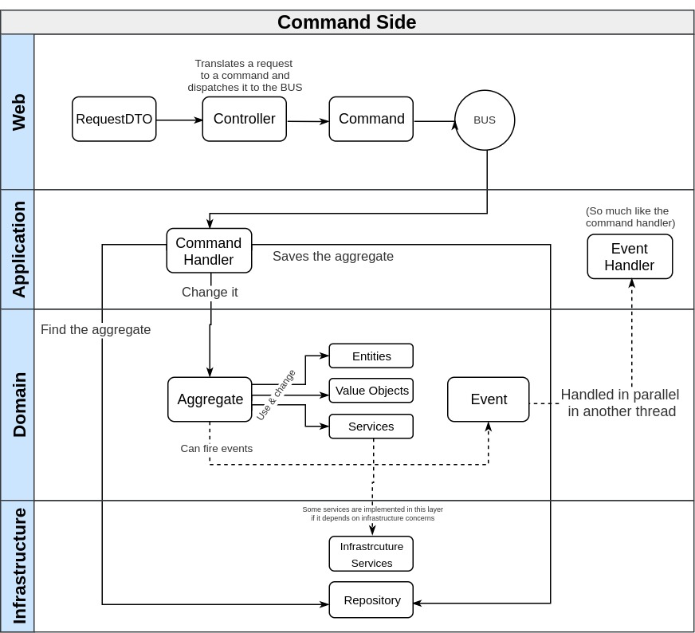
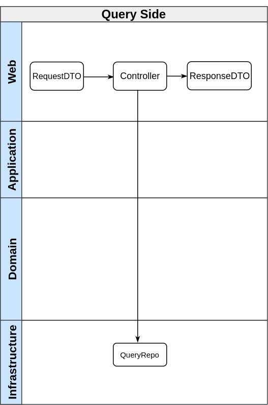

# Kotlin DDD Sample

**Kotlin DDD Sample** is a open-source project meant to be used as a start point, or an inspiration, for those who want to build Domain Driven Design applications in Kotlin. The domain model was inspired by [this](https://github.com/mcapanema/ddd-rails-example) repo where we built a sample project using Rails.

**NOTE:** This is NOT intended to be a definitive solution or a production ready project

# Technologies/frameworks/tools involved

- Spring
- Axon Framework
  - CommandGateway (Command Handlers)
  - EventBus (Event Handlers)
- Gradle

# Architecture overview

## Layers
- **Web**: Spring controllers and actions
- **Application**: Orchestrates the jobs in the domain needed to be done to accomplish a certain "use case"
- **Domain**: Where the business rules resides
- **Infrastructure**: Technologies concerns resides here (database access, sending emails, calling external APIs)

## CQRS

CQRS splits your application (and even the database in some cases) into two different paths: **Commands** and **Queries**.
 
### Command side

Every operation that can trigger an side effect on the server must pass through the CQRS "command side". I like to put the `Handlers` (commands handlers and events handlers) inside the application layer because their goals are almost the same: orchestrate domain operations (also usually using infrastructure services). 
 


### Query side

Pretty straight forward, the controller receives the request, calls the related query repo and returns a DTO (defined on infrastructure layer itself). 



# The domain (problem space)

This project is based on a didactic domain that basically consists in maintaining an Order (adding and removing items in it). The operations supported by the application are:

* Create an order 
* Add products ta a given order
* Change product quantity
* Remove product
* Pay the order (this operation fires an Event for the shipping bounded context) 
 * Shipping (side effect of the above event): ships product and notify user

Pretty simple, right? 

# Setup

**Linux/MacOS:** 

```
./gradlew build
```

**Windows:**

```
gradlew.bat build
```

### RabbitMQ setup

There is a file named `AMQPRabbitConfiguration` in this repo (located [here](https://github.com/fabriciorissetto/kotlin-ddd-sample/blob/master/web/src/main/configuration/injection/AMQPRabbitConfiguration.kt)) where the configuration needed by axon to integrate with RabbitMQ (to send end receive persistent messages) is stored. To use that, just remove the comments. 

You need a running rabbit, you can start one in a docker container using the following commands:

```bash
docker pull rabbitmq
docker run -d --hostname my-rabbit --name some-rabbit rabbitmq:3-management
```

You can access the rabbit UI by this url: [http://172.17.0.2:15672](http://172.17.0.2:15672).

* **User**: guest
* **Password**: guest
 
That's it. You don't need to do anything else, the setup in the `AMQPRabbitConfiguration` class will create the necessary queue and exchange in Rabbit and also configure axon accordingly. Note that if you customize something in your rabbit server you need to adjust the `application.properties` file (here we are using the default ports, ips, etc).

This both dependencies are used just for Rabbit:
 * `org.springframework.boot:spring-boot-starter-amqp`: enables AMQP in Spring Boot
 * `org.axonframework:axon-amqp`: configures some beans for axon to integrate with `SpringAMQPMessageSource` class from the above dependency

If you don't want o use an AMQP you can remove this dependencies from the web project gradle's file.

# Tests

```
./gradlew test
```

### Postman requests

You can trigger all the operations of this project using the requests inside [this json](https://github.com/fabriciorissetto/kotlin-ddd-sample/blob/master/docs/postman_example_requests.json) (just import it on your local postman).

# Backlog
- [x] Implement Unit Tests examples (Domain layer)
- [ ] Implement Integrated Tests examples (Web layer)
- [ ] Include docker container with JDK and gradle configured
- [ ] Configure Swagger and Swagger UI
- [ ] Include a Event Sourced bounded context or Aggregate
- [ ] Domain Notifications instead of raising exceptions
- [ ] Implement concrete repositories with JPA (the current implementations just returns fake instances)
- [ ] Configure JPMS (java 9 modules)

Contributions are welcome! :heartbeat:
